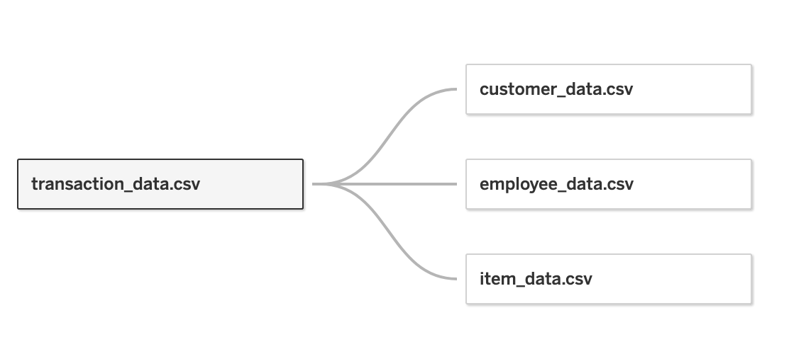
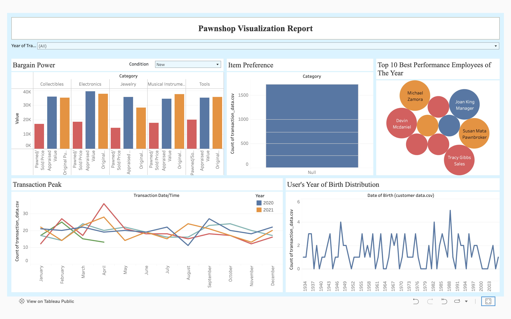

# Pawnshop Data Visualization

Data visualization: [Tableau](https://public.tableau.com/app/profile/elia.oktaviani/viz/PawnshopVisualization/Dashboard1?publish=yes)

Data visualization (dummy) created using Tableau Public from generated dummy data using Faker. In this condition arranged 4 csv files consist of customer_data.csv, employee_data.csv, item_data.csv, and transaction_data.csv. Relationship added through primary key Customer ID, Employee ID, Item ID to transaction_data.csv.

Info: Due to artificial data, many datas don't match between primary key and foreign key, so the data not joined properly dan created significant null value.

Nevertheless, the business metrics sucessfully visualized. In this case, we provided Bargain Power, Item Preference,Transaction Peak, User's Year of Birth Distribution, and Top 10 Best Performance Employees.

We added general filter 'Year of Transaction', to set metrics in specified year options.

Intercative dashboard can be accessed [here](https://public.tableau.com/app/profile/elia.oktaviani/viz/PawnshopVisualization/Dashboard1?publish=yes).

## Business Metrics

### 1. Bargain Power
In Bargain Power we visualized average value of pawned price, appraised value, and original purchase price in each item category. Wider gap between pawned price and appraised value show a weaker bargain power and sign a chance to increase profit in certain category item. For more detailed information we provided condition status of the item, so there are more direct approaches. 

Beside of that, we also can monitor applied regulation to calculate the pawned price (in example 30% of appraised value) in order to keep the SOP on track.

### 2. Item Preferences
We used Item Preferences to visualize the total number of items in each category that were dealt with. This information helps us identify which item categories are more likely to be pawned, redeemed, or sold.

This data can be used by business team (or related) to adjust prices based on the availability and demand of each item category, to optimize profits.

For marketing team, this information can provide insights into user behavior and preferences, identifying top-selling categories, and items that are more likely to be pawned, among other things.

### 3. Transaction Peak
In this visualization, we present the total transactions for each month based on the selected year filter. By analyzing transaction spikes, we can understand the seasonal patterns of customer behavior for transactions with our company.

### 4. Top 10 Best Performance Employees of the Year
In this visualization, 10 employees with the highest number of transactions in the year applied are displayed. For further, parameters that can be adjusted according to the best bargaining ability so, we can know which employees may contribute to improved profitability and look for their good strategy or traits to be applied to other employees.

### 5. User's Year of Birth Distribution
By using this information, we can gain a better understanding of our target audience. Followed by response rates, conversion rates, and purchase behavior across different age groups, we can assess an effective marketing campaigns and channels. This information is the first step to achive optimization of marketing spend and resource allocation to maximize return on investment (ROI) by targeting the most responsive and profitable age groups.

## Further Improvement
To achieve further improvements, it will be best to have directly collaborate with team to identify the most critical business metrics that need to be tracked and measured. It can develop a comprehensive framework that aligns with business goals and objectives. Automations also would be preferred by automate data preprocess dan update visualization to make a realtime monitoring and increase our productivity.
